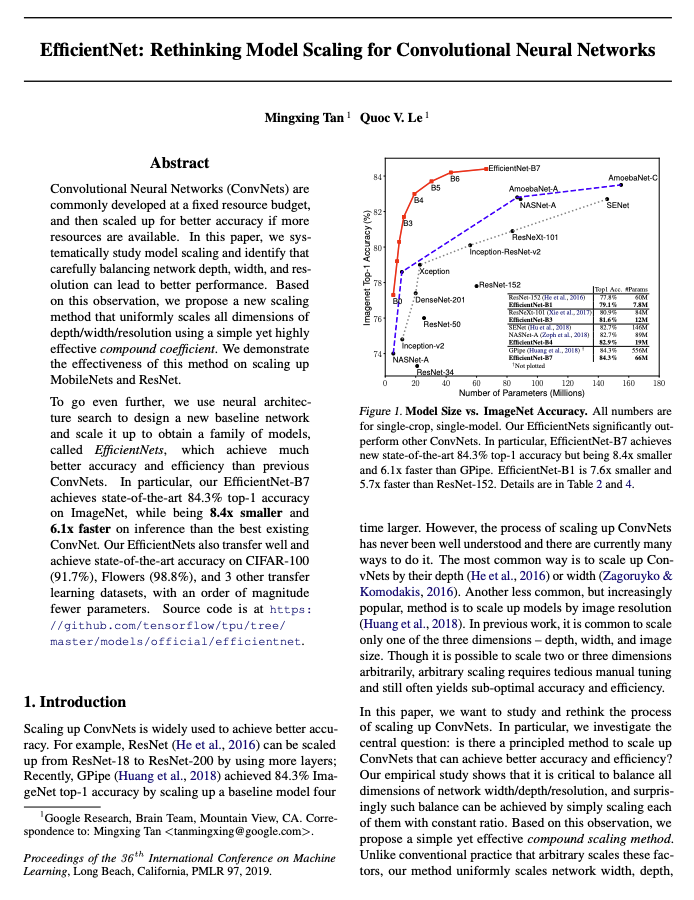

# OpenAPI를 이용한 논문, 기사, 글 요약 및 번역

### Full text

https://arxiv.org/pdf/1905.11946.pdf



### Summarization and translation (Korean)

EfficientNet-B7은 ImageNet에서 최고 84.3%의 정확도를 달성하는 동시에 기존 최고의 ConvNet보다 8.4배 작고 추론 속도가 6.1배 빠르다. 우리의 EfficientNets는 다른 ConvNets를 크게 능가한다. 이전 작업에서는 깊이, 너비, 이미지 크기 등 세 가지 차원 중 하나만 스케일링하는 것이 일반적이다. 단순하지만 매우 효과적인 복합 계수를 사용하여 깊이/폭/해상도의 모든 차원을 균일하게 확장하는 단순하지만 효과적인 복합 스케일링 방법을 제안한다. 예를 들어, 우리가 2N배 더 많은 계산 자원을 사용하고 싶다면, 우리는 단순히 원래 모델에서 네트워크를 작은 그리드만큼 늘릴 수 있다.

## Used APIs

### TLDRThis

- https://rapidapi.com/tldrthishq-tldrthishq-default/api/tldrthis/

### 네이버 Papago API

- https://developers.naver.com/products/papago/nmt/nmt.md

## Reference

```
이제현, 유시현, 김창기, 김현구, "Open API를 활용한 고속 논문 분석",
실용인공지능학회지 vol.1 p.9, 2022
```

- https://jehyunlee.github.io/2022/07/02/Python-DS-106-aaicon/
